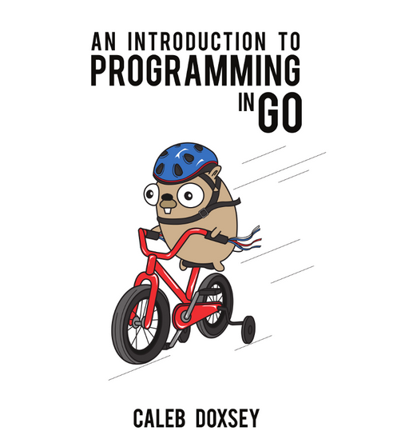

# 00-最新消息

\

<figure><figcaption></figcaption></figure>

說明：An Introduction to Programming in Go 的正體中文版，內容淺顯易懂，適合做為 Go 的入門資料。

譯者：[Aaron Ming-Yi Liao](https://netdpi.net)、Marcus Hsieh

網址：https://go.netdpi.net&#x20;

Email：aaron@netdpi.net

感謝「國立成功大學／電機工程學系」協助

感謝 Robert Lee 幫忙審閱中文翻譯

原著：Caleb Doxsey

網址：http://www.golang-book.com/

下載 PDF：



版權聲明：

© 2014 Caleb Doxsey. Cover Art: © 2012 Abigail Doxsey Anderson. All Rights Reserved.

Portions of this page may contain modifications based on work created and shared by Google and used according to terms described in the Creative Commons 3.0 Attribution License.

本著作係採用[創用姓名標示 3.0 台灣 授權條款](http://www.google.com/url?q=http%3A%2F%2Fcreativecommons.org%2Flicenses%2Fby%2F3.0%2Ftw%2F\&sa=D\&sntz=1\&usg=AOvVaw0kKB19u22X4HWDL19ITbto).
