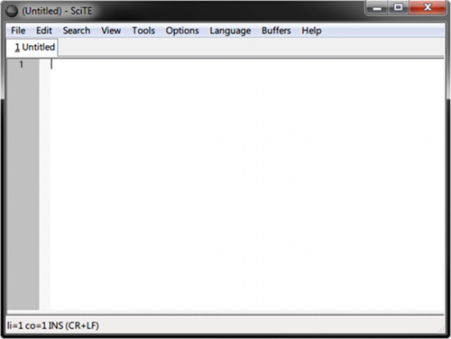
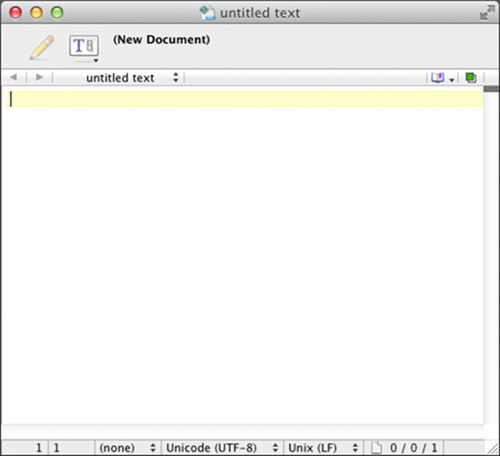

# 01.03-文字編輯器

### Text Editors 

程式設計師用來寫程式的主要工具是文字編輯器，類似文書處理程式（Microsoft Word、Open Office，...），但是與文書程式不同的是文字編輯器無法指定格式（沒有粗體、斜體、...），而是只能以純文字呈現。OSX 與 Windows 系統都有文字編輯器，但是功能太過侷限，所以我建議要另外安裝比較好用的。

為了讓這個軟體的安裝可以更簡單，安裝程式可以從本書的網站上取得：[http://www.golang-book.com/](http://www.google.com/url?q=http%3A%2F%2Fwww.golang-book.com%2F\&sa=D\&sntz=1\&usg=AOvVaw2ofwBpJf-k2BO\_lOQOMg9I)。這個安裝程式也會安裝 Go 工具套件（Go tool suite）、設定環境變數，以及安裝文字編輯器。

#### Windows 

在 Windows 系統上，安裝程式會裝上 Scite 文字編輯器，你可以到開始選單 → 所有程式 → Go → Scite 執行。 你應該會看到如下畫面：

<figure><figcaption></figcaption></figure>

文字編輯器有一個大的空白文字區域，這裡可以輸入文字。文字區域的左方可以看到行號，視窗的下面是狀態列，它會顯示檔案的資訊，以及你目前在檔案裡的位置（像圖中它就告訴我們現在位於第一列、第一行、文字正以一般方式插入、而我們正使用 Windows-style 的換行符號）。

開啟檔案的方式可以到 File → Open 並瀏覽你所需要的檔案。儲存檔案的方式是到 File → Save 或 File → Save As。

當你操作文字編輯器時，學會一些鍵盤的熱鍵是很好用的。選單將熱鍵在右邊列出，這裡有些常用的熱鍵：

*
  * Ctrl + S – 儲存目前的檔案
  * Ctrl + X – 剪下選擇的文字（移除文字並將文字放到剪貼簿裡，之後可以用來貼上）
  * Ctrl + C – 複製目前選擇的文字
  * Ctrl + V – 將剪貼簿中的文字貼上
  * 使用箭頭方向鍵來導航、Home 是到行的開頭、End 到行尾
  * 使用箭頭方向鍵（或 Home 或 End）時，持續按著 shift 可以不用滑鼠就選擇文字
  * Ctrl + F – 帶出一個 find 對話框，你可以用來搜尋檔案的內容

#### OSX 

OSX 安裝程式會安裝 Text Wrangler 文字編輯器：

<figure><figcaption></figcaption></figure>

類似 Windows 系統的 Scite，Text Wrangler 有個大的空白區域可以輸入文字。檔案可以到 File → Open 開啟，檔案可以到 File → Save 或 File → Save As 存檔。這裡有些好用的鍵盤熱鍵：（指令是 ⌘ 鍵）

*
  * Ctrl + S – 儲存目前的檔案
  * Ctrl + X – 剪下選擇的文字（移除文字並將文字放到剪貼簿裡，之後可以用來貼上）
  * Ctrl + C – 複製目前選擇的文字
  * Ctrl + V – 將剪貼簿中的文字貼上
  * 使用箭頭方向鍵來導航
  * Ctrl + F – 帶出一個 find 對話框，你可以用來搜尋檔案的內容
