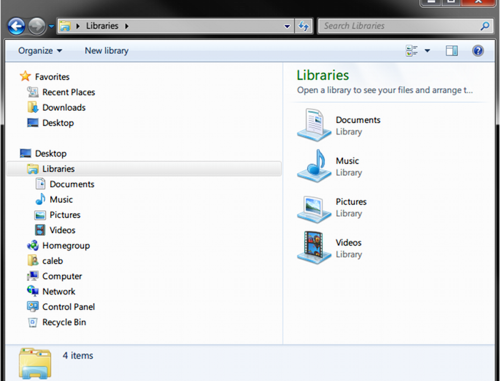
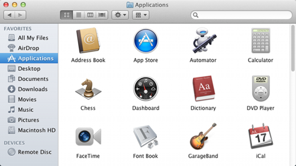

# 01.01-檔案與資料夾

檔案具有名字、將一批資料以一個單位儲存。現代的作業系統（如 Windows 或 Mac OSX）有幾百萬個檔案，儲存了大量的不同類型資訊，從文字檔、執行檔、到多媒體檔都有。

全部的檔案以同樣的方式儲存在電腦上：它們都有名字、明確的大小（以 byte 為單位），以及相關的類型。通常檔案的類型可以清楚的從副檔名得知，副檔名是檔名中「 . 」之後的部分。例如：一個 hello.txt 檔名，其副檔名 txt 是用來表示它是個文字資料。

資料夾（也稱為目錄）是用來將檔案分類，資料夾中也可以有其它資料夾。在 Windows 檔案及資料夾路徑（位置）中，用 '\\' 字元區隔，例如：C:\Users\john\example.txt 的 example.txt 就是檔名，它位在 john 資料夾裡，而 john 資料夾位在 Users 資料夾中，Users 則位在 C 磁碟（這是 Windows 中主要的實體硬碟）。在 OSX 裡（以及多數其它的作業系統），檔案與資料夾路徑是用 '/' 字元隔開，例如：/Users/john/example.txt。類似在 Windows 中，example.txt 是檔名，它也是位在 john 資料夾中，而 john 位在 Users 資料夾中，與 Windows 不一樣的是，OSX 沒有標示儲存檔案的磁碟字母代號。

#### Windows 

在 Windows 裡，檔案與資料夾可以透過檔案管理員（Windows Explorer）瀏覽（透過滑鼠連擊我的電腦或按著 win + e）：

<figure><figcaption></figcaption></figure>

#### OSX 

在 OSX 系統，檔案與資料夾可以使用 Finder 瀏覽（透過滑鼠連擊 Finder 圖形，在下方左邊有個臉的圖案）：

\
