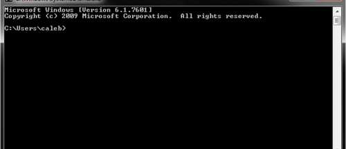
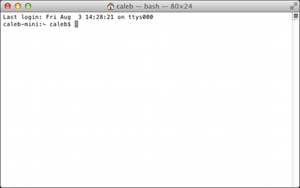

# 01.02-終端機（Terminal）

### The Terminal 

今日我們大多透過圖形使用者介面（GUI）與電腦互動，我們用鍵盤、滑鼠、觸控螢幕與虛擬按鍵或其它在螢幕上呈現的控制元件來與電腦互動。

但不是本來就用這個方法，我們在 GUI 出現以前是用終端機（terminal），這是個簡化的文字介面，螢幕上沒有控制的按鍵，而我們只是透過下指令與接收回應，與電腦對話。

雖然終端機已經從大部分的電腦世界消失，恍如過去的遺跡，然而事實的真相是終端機仍然是大多數電腦上最多程式語言使用的基本使用者介面。Go 程式語言也一樣，所以在我們開始用 Go 寫程式之前，我們要先對終端機的運作有所了解。

**Windows**

在 Windows 系統裡，終端機（所謂的命令提示字元）可以透過按下 windows 鍵 + r（一直按著 windows 鍵，然後按 r），並接著輸入 cmd.exe，然後按下 Enter。你應該會看到一個黑色的視窗出現，類似這樣：

<figure><figcaption></figcaption></figure>

預設的情況，命令提示字元會從你的個人資料夾開始（以我而言，個人資料夾在 C:\Users\caleb），你可以輸入指令並按下 Enter 來執行。試著輸入 dir 指令，這個會列出資料夾的內容，你應該可以看到類似這樣的東西：

C:\Users\caleb>dir Volume in drive C has no label. Volume Serial Number is B2F5-F125

你的個人資料夾裡有一堆檔案與資料夾，你可以使用 cd 指令切換資料夾，例如：你可能會有個資料夾叫做 Desktop，你可以透過輸入 cd Desktop 進入資料夾，並輸入 dir 看到資料夾的內容。如果要退回到你的個人資料夾，可以用特別的資料夾名稱 ..（兩個句號）： cd ..，單個句號表示目前的資料夾（也是所謂的工作資料夾），所以 cd . 不會發生什麼事情。還有很多指令可以讓你使用，不過剛開始這些應該就夠用了。

#### OSX 

在 OSX 裡，終端機可以透過 Finder → Applications → Utilities → Terminal 找到，你應該可以看到一個如下的視窗：

<figure><figcaption></figcaption></figure>

預設的情況，命令提示字元會從你的個人資料夾開始（以我而言，個人資料夾在 C:\Users\caleb），你可以輸入指令並按下 Enter 來執行。試著輸入 ls 指令，這個會列出資料夾的內容，你應該可以看到類似這樣的東西：

caleb-min:\~ caleb$ ls Desktop Downloads Movies Pictures Documents Library Music Public

你的個人資料夾裡有一堆檔案與資料夾，你可以使用 cd 指令切換資料夾，例如：你可能會有個資料夾叫做 Desktop，你可以透過輸入 cd Desktop 進入資料夾，並輸入 dir 看到資料夾的內容。如果要退回到你的個人資料夾，可以用特別的資料夾名稱 ..（兩個句號）： cd ..，單個句號表示目前的資料夾（也是所謂的工作資料夾），所以 cd . 不會發生什麼事情。還有很多指令可以讓你使用，不過剛開始這些應該就夠用了。
